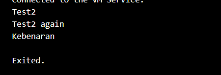

# **Tugas Praktikum**

## **1. Silakan selesaikan Praktikum 1 sampai 3, lalu dokumentasikan berupa screenshot hasil pekerjaan beserta penjelasannya!**

### **Praktikum 1: Menerapkan Control Flows ("if/else")**

**Langkah 1:**

Ketik atau salin kode program berikut ke dalam fungsi main().
String test = "test2";
```dart
if (test == "test1") {
   print("Test1");
} else If (test == "test2") {
   print("Test2");
} Else {
   print("Something else");
}

if (test == "test2") print("Test2 again");
```

**Langkah 2:**

Silakan coba eksekusi (Run) kode pada langkah 1 tersebut. 

**Hasil**


Apa yang terjadi? Jelaskan!

**Penjelasan:**

Pada hasil yang pertama terdapat error dikarenakan terjadi kesalahan penulisan "If" dan "Else", yang seharusnya ditulis sebagai "if" dan "else" dengan huruf kecil seluruhnya.

**Kode setelah diperbaiki**

```dart
  if (test == "test1") {
    print("Test1");
  } else if (test == "test2") {
    print("Test2");
  } else {
    print("Something else");
  }

  if (test == "test2") print("Test2 again");
```
**Hasil**


**Penjelasan:**

Pada kondisi pertama, variabel test bernilai "test2", sehingga pernyataan else if (test == "test2") terpenuhi dan mencetak "Test2".
Kondisi kedua juga mengecek apakah test == "test2", sehingga mencetak "Test2 again".

**Langkah 3:**

Tambahkan kode program berikut, lalu coba eksekusi (Run) kode Anda.
```dart
String test = "true";
if (test) {
   print("Kebenaran");
}
```
**Hasil**


Apa yang terjadi ? Jika terjadi error, silakan perbaiki namun tetap menggunakan if/else.

**Penjelasan:**

Error yang terjadi: Error ini muncul karena Dart tidak bisa menggunakan String langsung dalam kondisi if. Kondisi if hanya menerima ekspresi boolean, bukan string seperti "true".

**Perbaikan Kode**
```dart
 String isTrue = "true"; // Renamed variable to avoid redeclaration error
  if (isTrue == "true") {
    print("Kebenaran");
  }
```
**Hasil**



**Penjelasan:**

Baris kode String isTrue = "true"; digunakan untuk menyimpan string "true" ke dalam variabel isTrue.

Kemudian pada bagian if (isTrue == "true"), kita membandingkan apakah isi variabel isTrue sama dengan string "true". Jika kondisi ini terpenuhi (true), maka perintah di dalam blok if akan dijalankan dan mencetak "Kebenaran".


### **Praktikum 2: Menerapkan Perulangan "while" dan "do-while"**

**Langkah 1:**

Ketik atau salin kode program berikut ke dalam fungsi main().
```dart
while (counter < 33) {
  print(counter);
  counter++;
}
```

**Langkah 2:**

Silakan coba eksekusi (Run) kode pada langkah 1 tersebut. Apa yang terjadi? Jelaskan! Lalu perbaiki jika terjadi error.

**Hasil**


**Penjelasan:**
Kode program menghasilkan error karena variabel counter belum dideklarasikan atau diinisialisasi. Dalam Dart, semua variabel harus dideklarasikan sebelum digunakan.

Perbaikan Kode
```dart
int counter = 0; // Deklarasi dan inisialisasi counter
  while (counter < 33) {
    print(counter);
    counter++;
}
```
**Hasil**


**Langkah 3:**

Tambahkan kode program berikut, lalu coba eksekusi (Run) kode Anda.
```dart
do {
  print(counter);
  counter++;
} while (counter < 77);
```
**Hasil**


Apa yang terjadi ? Jika terjadi error, silakan perbaiki namun tetap menggunakan do-while.

**Penjelasan:**

Tidak ada error yang akan terjadi dalam kode ini, karena variabel counter sudah dideklarasikan dan diinisialisasi dengan benar, serta sintaks do-while sudah tepat.

Perulangan do-while akan mengeksekusi blok kode setidaknya satu kali, bahkan jika kondisi awal tidak terpenuhi. Dalam contoh ini, blok do akan mencetak nilai counter terlebih dahulu, baru kemudian mengecek kondisi counter < 77.

Jika kode ini dijalankan, output akan menampilkan angka dari 0 hingga 76, karena:

a. Perulangan while mencetak dari 0 hingga 32.

b. Perulangan do-while mencetak dari 33 hingga 76.


### **Praktikum 3: Menerapkan Perulangan "for" dan "break-continue"**

**Langkah 1:**

Ketik atau salin kode program berikut ke dalam fungsi main().
```dart
for (Index = 10; index < 27; index) {
  print(Index);
}
```

**Langkah 2:**

Silakan coba eksekusi (Run) kode pada langkah 1 tersebut. Apa yang terjadi? Jelaskan! Lalu perbaiki jika terjadi error.

**Hasil**


**Penjelasan:**

a. int index = 10: Variabel index diinisialisasi dengan nilai 10.

b. index < 27: Perulangan akan terus berjalan selama nilai index kurang dari 27.

c. index++: Pada setiap iterasi, nilai index bertambah 1.

**Langkah 3:**

Tambahkan kode program berikut di dalam for-loop, lalu coba eksekusi (Run) kode Anda.
```dart
If (Index == 21) break;
Else If (index > 1 || index < 7) continue;
print(index);
```
**Hasil**


Apa yang terjadi ? Jika terjadi error, silakan perbaiki namun tetap menggunakan for dan break-continue.

**Penjelasan:**

a. if (index == 21) break;: Jika nilai index mencapai 21, perulangan dihentikan (keluar dari loop).

b. else if (index > 1 && index < 7) continue;: Jika nilai index berada antara 2 dan 6, perintah continue dilewatkan sehingga iterasi dilanjutkan tanpa mencetak nilai tersebut.

c. print(index);: Mencetak nilai index jika tidak terkena continue atau break.

Program akan mencetak angka mulai dari 10 hingga 20, tetapi melewatkan iterasi yang nilainya antara 2 hingga 6 (yang sebenarnya tidak ada dalam rentang ini). Karena kita mulai dari 10, bagian continue tidak akan digunakan, dan perulangan berhenti pada 21.


### **2. Buatlah sebuah program yang dapat menampilkan bilangan prima dari angka 0 sampai 201 menggunakan Dart. Ketika bilangan prima ditemukan, maka tampilkan nama lengkap dan NIM Anda.**
**Kode Program**
```dart
void main() {
  String namaLengkap = "Sandra Devia Arge";  
  String NIM = "2241720222";  

  // Fungsi untuk mengecek apakah suatu angka merupakan bilangan prima
  bool isPrime(int number) {
    if (number < 2) return false; // 0 dan 1 bukan bilangan prima
    for (int i = 2; i <= number ~/ 2; i++) {
      if (number % i == 0) {
        return false;
      }
    }
    return true;
  }

  // Menampilkan bilangan prima dari 0 hingga 201
  for (int i = 0; i <= 201; i++) {
    if (isPrime(i)) {
      print('$i adalah bilangan prima.');
      print('Nama: $namaLengkap, NIM: $NIM');
    }
  }
}
```


**Hasil**

