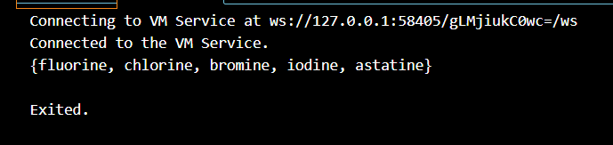
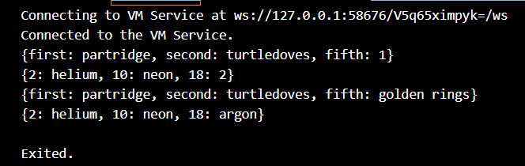
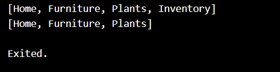

# **Tugas Praktikum**

## **1. Silakan selesaikan Praktikum 1 sampai 5, lalu dokumentasikan berupa screenshot hasil pekerjaan Anda beserta penjelasannya!**

### **Praktikum 1: Eksperimen Tipe Data List**

**Langkah 1:**

Ketik atau salin kode program berikut ke dalam void main().
```dart
var list = [1, 2, 3];
assert(list.length == 3);
assert(list[1] == 2);
print(list.length);
print(list[1]);

list[1] = 1;
assert(list[1] == 1);
print(list[1]);
```

**Langkah 2:**

Silakan coba eksekusi (Run) kode pada langkah 1 tersebut. 

**Hasil**


Apa yang terjadi? Jelaskan!

**Penjelasan:**

> Kode tersebut membuat daftar (list) dengan nilai [1, 2, 3].

> Kode mengecek panjang list (3) dan elemen kedua (2) menggunakan assert.

> Setelah itu, mencetak panjang list (3) dan elemen kedua (2).

> Nilai elemen kedua kemudian diubah menjadi 1.

> Terakhir, kode memastikan perubahan berhasil dan mencetak nilai elemen kedua yang baru (1).

Jika kode dijalankan, outputnya adalah: 3, 2, 1.

**Langkah 3:**

Ubah kode pada langkah 1 menjadi variabel final yang mempunyai index = 5 dengan default value = null. Isilah nama dan NIM Anda pada elemen index ke-1 dan ke-2. Lalu print dan capture hasilnya.

Apa yang terjadi ? Jika terjadi error, silakan perbaiki.

**Perubahan Kode**
```dart
final List<String?> list = List<String?>.filled(5, null);

  list[1] = "Sandra Devia Arge";  
  list[2] = "2241720222";   

  print(list.length);  
  print(list[1]);      
  print(list[2]);     
  print(list);  
``` 

**Hasil**


**Penjelasan**
> final list = List.filled(5, null): Membuat list dengan panjang 5, di mana semua elemennya bernilai null.

> list[1] = "Nama Anda": Mengisi elemen index ke-1 dengan nama.

> list[2] = "NIM Anda": Mengisi elemen index ke-2 dengan NIM.

> print(list): Mencetak seluruh isi list untuk melihat hasilnya.

**Note**

Setelah modifikasi ke final dengan default null, program dapat berjalan tanpa error jika tipe list diubah menjadi List<String?> agar sesuai dengan nilai String yang akan dimasukkan.


### **Praktikum 2: Eksperimen Tipe Data Set**

**Langkah 1:**

Ketik atau salin kode program berikut ke dalam fungsi main().
```dart
var halogens = {'fluorine', 'chlorine', 'bromine', 'iodine', 'astatine'};
print(halogens);
```

**Langkah 2:**

Silakan coba eksekusi (Run) kode pada langkah 1 tersebut.Apa yang terjadi? Jelaskan! Lalu perbaiki jika terjadi error.

**Hasil**


**Penjelasan:**

> var halogens mendeklarasikan sebuah set, yang merupakan koleksi dari nilai unik (dalam hal ini nama-nama unsur halogen).

> Fungsi print(halogens) akan menampilkan elemen-elemen dalam set ke konsol.

Dart secara otomatis mengerti bahwa {} tanpa pasangan key: value adalah sebuah set. Oleh karena itu, kode ini akan berjalan tanpa error.

**Langkah 3:**

Tambahkan kode program berikut, lalu coba eksekusi (Run) kode Anda.
```dart
var names1 = <String>{};
Set<String> names2 = {}; // This works, too.
var names3 = {}; // Creates a map, not a set.

print(names1);
print(names2);
print(names3);
```
Apa yang terjadi ? Jika terjadi error, silakan perbaiki namun tetap menggunakan ketiga variabel tersebut. 

**Hasil**


**Penjelasan**

**1. var names1 = <String>{};**

Ini mendeklarasikan names1 sebagai Set<String>, yaitu sebuah himpunan yang hanya bisa berisi elemen-elemen bertipe String.

**Set<String> names2 = {};**

Ini seharusnya juga mendeklarasikan names2 sebagai Set<String>, namun dalam Dart, {} secara default adalah Map, bukan Set. Ini bisa menimbulkan masalah.

**var names3 = {};**

Ini mendeklarasikan names3 sebagai Map, karena {} tanpa tipe eksplisit default-nya adalah Map di Dart.

**Note:**

Jika ingin names3 menjadi set kosong, maka harus mendeklarasikannya dengan tipe Set seperti ini:
```dart
var names3 = <String>{}; // Ini adalah set kosong.
```

Tambahkan elemen nama dan NIM Anda pada kedua variabel Set tersebut dengan dua fungsi berbeda yaitu .add() dan .addAll(). Untuk variabel Map dihapus, nanti kita coba di praktikum selanjutnya.

**Kode Program yang ditambahkan:**
```dart
// Menambahkan elemen menggunakan .add()
  names1.add('Sandra Devia Arge');
  names1.add('2241720222');

// Menambahkan elemen menggunakan .addAll()
  names2.addAll({'Sandra Devia Arge', '2241720222'});
```
**Hasil**


**Penjelasan:**

**1. names1.add('Sandra Devia Arge');**

Menggunakan metode .add() untuk menambahkan elemen tunggal ke dalam set names1.

**2. names1.add('2241720222');**

Menambahkan elemen kedua ke dalam set names1.

**3. names2.addAll({'Sandra Devia Arge', '2241720222'});**

Menggunakan metode .addAll() untuk menambahkan beberapa elemen sekaligus ke dalam set names2.

### **Praktikum 3: Eksperimen Tipe Data Maps**

**Langkah 1:**

Ketik atau salin kode program berikut ke dalam fungsi main().
```dart
var gifts = {
  // Key:    Value
  'first': 'partridge',
  'second': 'turtledoves',
  'fifth': 1
};

var nobleGases = {
  2: 'helium',
  10: 'neon',
  18: 2,
};

print(gifts);
print(nobleGases);
```

**Langkah 2:**

Silakan coba eksekusi (Run) kode pada langkah 1 tersebut. Apa yang terjadi? Jelaskan! Lalu perbaiki jika terjadi error.

**Hasil**


**Penjelasan:**

**Tipe Data Map di Dart: Kode di atas membuat dua objek Map:**

> gifts dengan kunci bertipe String dan nilai bertipe String atau int.

> nobleGases dengan kunci bertipe int dan nilai bertipe String atau int.

**Hasil Output:**

> print(gifts); menampilkan map gifts dengan kunci dan nilai yang sesuai.

> print(nobleGases); menampilkan map nobleGases dengan kunci dan nilai yang sesuai.

**Note:**

**Kunci Map:** Kunci dalam map Dart bisa berupa berbagai tipe data (seperti String, int, dll.), tetapi dalam satu map, sebaiknya menggunakan tipe data yang konsisten. Dalam kasus ini, kunci pada gifts adalah String, dan pada nobleGases adalah int.

**Langkah 3:**

Tambahkan kode program berikut, lalu coba eksekusi (Run) kode Anda.
```dart
var mhs1 = Map<String, String>();
gifts['first'] = 'partridge';
gifts['second'] = 'turtledoves';
gifts['fifth'] = 'golden rings';

var mhs2 = Map<int, String>();
nobleGases[2] = 'helium';
nobleGases[10] = 'neon';
nobleGases[18] = 'argon';
```
Apa yang terjadi ? Jika terjadi error, silakan perbaiki.

**Hasil**



**Penjelasan**

**Membuat Map Baru:**

> var mhs1 = Map<String, String>(); membuat map baru mhs1 dengan kunci bertipe String dan nilai bertipe String. Namun, map ini tidak digunakan lebih lanjut dalam kode.

> var mhs2 = Map<int, String>(); membuat map baru mhs2 dengan kunci bertipe int dan nilai bertipe String. Seperti mhs1, mhs2 juga tidak digunakan lebih lanjut dalam kode.

**Modifikasi Map yang Ada:**

> gifts['first'] = 'partridge'; - Mengatur ulang nilai untuk kunci 'first' dalam map gifts. Namun, nilainya tetap sama yaitu 'partridge', jadi tidak ada perubahan yang terlihat.

> gifts['second'] = 'turtledoves'; - Sama seperti sebelumnya, nilai 'second' tetap 'turtledoves'.

> gifts['fifth'] = 'golden rings'; - Mengubah nilai untuk kunci 'fifth' dari 1 menjadi 'golden rings'.

> nobleGases[2] = 'helium'; - Nilai untuk kunci 2 tetap 'helium'.

> nobleGases[10] = 'neon'; - Nilai untuk kunci 10 tetap 'neon'.

> nobleGases[18] = 'argon'; - Mengubah nilai untuk kunci 18 dari 2 menjadi 'argon'.

Tambahkan elemen nama dan NIM Anda pada tiap variabel di atas (gifts, nobleGases, mhs1, dan mhs2). Dokumentasikan hasilnya dan buat laporannya!

**Modifikasi Kode Program:**
```dart
void main(){
  var gifts = {
  // Key:    Value
  'first': 'partridge',
  'second': 'turtledoves',
  'fifth': 1,
  'name': 'Sandra Devia Arge', 
  'NIM': '2241720222',   
};

var nobleGases = {
  2: 'helium',
  10: 'neon',
  18: 2,
  1: 'Sandra Devia Arge', 
  0: '2241720222', 
};

print(gifts);
print(nobleGases);

var mhs1 = Map<String, String>();
  gifts['first'] = 'partridge';
  gifts['second'] = 'turtledoves';
  gifts['fifth'] = 'golden rings';
  mhs1['name'] = 'Sandra Devia Arge';
  mhs1['NIM'] = '2241720250';

  var mhs2 = Map<int, String>();
  nobleGases[2] = 'helium';
  nobleGases[10] = 'neon';
  nobleGases[18] = 'argon';
  mhs2[1] = 'Sandra Devia Arge';
  mhs2[0] = '2241720250';

  print(gifts);
  print(nobleGases);    
}

```
**Hasil**


### **Praktikum 4: Eksperimen Tipe Data List: Spread dan Control-flow Operators**

**Langkah 1:**

Ketik atau salin kode program berikut ke dalam fungsi main().
```dart
var list = [1, 2, 3];
var list2 = [0, ...list];
print(list1);
print(list2);
print(list2.length);
```

**Langkah 2:**

Silakan coba eksekusi (Run) kode pada langkah 1 tersebut. Apa yang terjadi? Jelaskan! Lalu perbaiki jika terjadi error.

**Hasil**


**Penjelasan**
Error terjadi pada print(list1); karena variabel list1 tidak dideklarasikan sebelumnya. Seharusnya, yang dicetak adalah list, bukan list1.

**Perbaikan Kode**
```dart
  var list = [1, 2, 3];
  var list2 = [0, ...list];
  print(list);
  print(list2);
  print(list2.length);
```

**Hasil**


**Langkah 3:**

Tambahkan kode program berikut, lalu coba eksekusi (Run) kode Anda.
```dart
list1 = [1, 2, null];
print(list1);
var list3 = [0, ...?list1];
print(list3.length);
```
Apa yang terjadi ? Jika terjadi error, silakan perbaiki.

**Hasil**


**Penjelasan**

Penulisan list1 = [1, 2, null]; harus menggunakan kata kunci var atau final jika sebelumnya belum pernah dideklarasikan.

**Perbaikan Kode**
```dart
  var list1 = [1, 2, null];
  print(list1);
  var list3 = [0, ...?list1];
  print(list3.length);
```

**Hasil**


**Penjelasan**

> list1 adalah sebuah list dengan nilai [1, 2, null].

> Spread operator dengan tanda ...?list1 artinya jika list1 tidak null, maka elemen-elemen dari list1 akan disebarkan ke dalam list3. Namun jika list1 null, maka spread operator tidak akan menyebarkan apa pun (artinya tidak menambahkan apa pun ke list3).

> print(list3.length); akan mencetak panjang list3, yang seharusnya 4 (karena list3 berisi [0, 1, 2, null]).

Tambahkan variabel list berisi NIM Anda menggunakan Spread Operators. Dokumentasikan hasilnya dan buat laporannya!

**Kode**
```dart
var nimList = [2, 2, 4, 1, 7, 2, 0, 2, 5, 0];
  var list4 = [...nimList, ...?list1];
  
  print(list4);
  print(list4.length);
```

**Hasil**


**Penjelasan**

> Spread Operator digunakan untuk menggabungkan elemen dari nimList dan list1 ke dalam list baru list4.

> Panjang list4 adalah 13, karena terdapat 10 elemen dari NIM dan 3 elemen dari list1, termasuk nilai null.

**Langkah 4:**

Tambahkan kode program berikut, lalu coba eksekusi (Run) kode Anda.
```dart
var nav = ['Home', 'Furniture', 'Plants', if (promoActive) 'Outlet'];
print(nav);
```
Apa yang terjadi ? Jika terjadi error, silakan perbaiki. Tunjukkan hasilnya jika variabel promoActive ketika true dan false.

**Hasil**


**Penjelasan**

> Di sini, list nav menggunakan ekspresi bersyarat if untuk memasukkan elemen 'Outlet' hanya jika variabel promoActive bernilai true.

> Jika promoActive == false, elemen 'Outlet' tidak akan dimasukkan ke dalam list nav.

Namun, kode ini akan menghasilkan error jika variabel promoActive belum dideklarasikan. Jadi, kita perlu mendeklarasikan variabel tersebut sebelum menggunakan ekspresi if dalam list.

**Perbaikan Kode**

Tambahkan deklarasi promoActive dan coba eksekusi kode dengan dua kondisi, true dan false

```dart
  bool promoActive = true; // Atur promoActive ke true
  var nav = ['Home', 'Furniture', 'Plants', if (promoActive) 'Outlet'];
  print(nav);

  promoActive = false; // Ubah promoActive ke false
  nav = ['Home', 'Furniture', 'Plants', if (promoActive) 'Outlet'];
  print(nav);
```

**Hasil**


**Ketika promoActive bernilai true:**


**Ketika promoActive bernilai false:**


**Penjelasan**

> Saat promoActive == true, list nav berisi elemen 'Outlet'.

> Saat promoActive == false, elemen 'Outlet' tidak ditambahkan ke dalam list nav.

**Langkah 5:**

Tambahkan kode program berikut, lalu coba eksekusi (Run) kode Anda.

```dart
var nav2 = ['Home', 'Furniture', 'Plants', if (login case 'Manager') 'Inventory'];
print(nav2);
```
Apa yang terjadi ? Jika terjadi error, silakan perbaiki. Tunjukkan hasilnya jika variabel login mempunyai kondisi lain.

**Hasil**


**Penjelasan**
Pada Langkah 5, kode menggunakan bentuk kondisi if yang tidak sepenuhnya benar, khususnya pada ekspresi if (login case 'Manager'). Ekspresi case tidak digunakan dengan cara ini dalam Dart.

Untuk memperbaiki kode tersebut, kita dapat menggunakan ekspresi if-else biasa untuk memeriksa kondisi variabel login. 

**Perbaikan Kode**
```dart
var login = 'Manager'; // Kondisi login sebagai Manager
  var nav2 = ['Home', 'Furniture', 'Plants', if (login == 'Manager') 'Inventory'];
  print(nav2);

  // Coba kondisi login yang berbeda
  login = 'User'; // Ubah login ke User
  nav2 = ['Home', 'Furniture', 'Plants', if (login == 'Manager') 'Inventory'];
  print(nav2);
```
**Hasil**



**Ketika login bernilai 'Manager':**


**Ketika login bernilai 'User' (atau kondisi lain):**


**Penjelasan**

> Saat login == 'Manager', elemen 'Inventory' akan muncul di dalam list nav2.

> Saat login memiliki nilai lain seperti 'User', elemen 'Inventory' tidak akan ditambahkan.

> Di sini, kita menggunakan ekspresi if (login == 'Manager') untuk memeriksa apakah nilai dari variabel login adalah 'Manager'. Jika benar, elemen 'Inventory' akan ditambahkan ke dalam list nav2.

> Jika login bernilai selain 'Manager', elemen 'Inventory' tidak akan dimasukkan.

**Langkah 6:**

Tambahkan kode program berikut, lalu coba eksekusi (Run) kode Anda.
```dart
var listOfInts = [1, 2, 3];
var listOfStrings = ['#0', for (var i in listOfInts) '#$i'];
assert(listOfStrings[1] == '#1');
print(listOfStrings);
```
Apa yang terjadi ? Jika terjadi error, silakan perbaiki. Jelaskan manfaat Collection For dan dokumentasikan hasilnya.

**Hasil**


**Penjelasan**

Elemen pertama dari list listOfStrings adalah #0, dan elemen selanjutnya berasal dari Collection For berdasarkan list listOfInts.

**1. List of Integers (listOfInts):**

> List listOfInts berisi tiga elemen [1, 2, 3].

**2. Collection For:**

> for (var i in listOfInts) '#$i' adalah Collection For, yang digunakan untuk menghasilkan elemen list baru dengan menjalankan iterasi dari list yang ada (listOfInts). Pada setiap iterasi, elemen dari listOfInts digunakan untuk membangun elemen baru dalam listOfStrings yang diformat dengan string '#' diikuti oleh nilai dari i.

Hasil dari Collection For akan menjadi list string dengan format #1, #2, dan #3, yang berasal dari listOfInts.

**3. Assert Statement:**

> assert(listOfStrings[1] == '#1'); memverifikasi bahwa elemen kedua dari listOfStrings benar-benar bernilai '#1'. Jika pernyataan ini salah, program akan menghasilkan error.

**4. Print Statement:**

> print(listOfStrings); mencetak list hasil dari Collection For dan elemen tambahan.

Ini membuktikan bahwa Collection For adalah cara efektif untuk membuat list dari iterasi dengan elemen-elemen yang dinamis.

**Manfaat Collection For:**

**Sederhana:** Collection For memungkinkan kita membangun list baru dengan mudah dari list yang ada tanpa harus menulis loop secara eksplisit. Ini mempercepat pembuatan list secara dinamis.

**Fleksibel:** Collection For memungkinkan kita menambahkan logika ke dalam pembuatan list, seperti penambahan kondisi atau pemformatan elemen.

**Efisien:** Kode menjadi lebih ringkas dan mudah dipahami dibandingkan menulis loop yang eksplisit.


### **Praktikum 5: Eksperimen Tipe Data Records**

**Langkah 1:**

Ketik atau salin kode program berikut ke dalam fungsi main().
```dart
var record = ('first', a: 2, b: true, 'last');
print(record)
```

**Langkah 2:**

Silakan coba eksekusi (Run) kode pada langkah 1 tersebut. Apa yang terjadi? Jelaskan! Lalu perbaiki jika terjadi error.

**Hasil**


**Penjelasan**

> 'first': sebuah nilai string.

> a: 2: mencoba memberikan nama a untuk nilai 2.

> b: true: mencoba memberikan nama b untuk nilai true.

> 'last': sebuah nilai string.

**Langkah 3:**

Tambahkan kode program berikut di luar scope void main(), lalu coba eksekusi (Run) kode Anda.
```dart
(int, int) tukar((int, int) record) {
  var (a, b) = record;
  return (b, a);
}
```
Apa yang terjadi ? Jika terjadi error, silakan perbaiki. Gunakan fungsi tukar() di dalam main() sehingga tampak jelas proses pertukaran value field di dalam Records.

**Hasil**


**Penjelasan**

**Deklarasi Fungsi tukar:**

> Input: Menerima sebuah record dengan dua integer (int, int).

> Proses: Menggunakan destructuring untuk memisahkan nilai-nilai dalam record ke dalam variabel a dan b.

> Output: Mengembalikan record baru dengan nilai a dan b yang telah ditukar posisinya (b, a).

**Langkah 4:**

Tambahkan kode program berikut di dalam scope void main(), lalu coba eksekusi (Run) kode Anda.
```dart
// Record type annotation in a variable declaration:
(String, int) mahasiswa;
print(mahasiswa);
```
Apa yang terjadi ? Jika terjadi error, silakan perbaiki. Inisialisasi field nama dan NIM Anda pada variabel record mahasiswa di atas. Dokumentasikan hasilnya dan buat laporannya!

**Hasil**


**Penjelasan**

**Deklarasi Record Tanpa Inisialisasi:**

> Pada baris  (String, int) mahasiswa;, kita mendeklarasikan variabel mahasiswa sebagai record dengan dua field: satu string (nama) dan satu integer (NIM).

> Jika kita mencoba mencetak mahasiswa sebelum menginisialisasinya, Dart akan memberikan error karena variabel tersebut belum memiliki nilai. Pesan error yang muncul adalah: "The variable 'mahasiswa' must be initialized."

**Perbaikan Kode**
```dart
  var mahasiswa = ('Sandra Devia Arge', 2241720222);
  print(mahasiswa);
```
**Hasil**


**Penjelasan**

**Inisialisasi Record:**

> Setelah mendeklarasikan mahasiswa, kita perlu menginisialisasinya dengan nilai yang sesuai. Dalam contoh ini, kita menginisialisasi dengan nama dan NIM yang diinginkan.

> Setelah inisialisasi, ketika kita mencetak mahasiswa, hasilnya akan menampilkan record dalam format (Nama Anda, 123456).

> Penting untuk selalu menginisialisasi variabel sebelum menggunakannya dalam Dart. Deklarasi tanpa inisialisasi akan menyebabkan error saat kompilasi.

> Dengan menggunakan record, kita dapat menyimpan beberapa nilai terkait dalam satu variabel dengan tipe data yang berbeda.

**Langkah 5:**

Tambahkan kode program berikut di dalam scope void main(), lalu coba eksekusi (Run) kode Anda.
```dart
var mahasiswa2 = ('first', a: 2, b: true, 'last');

print(mahasiswa2.$1); // Prints 'first'
print(mahasiswa2.a); // Prints 2
print(mahasiswa2.b); // Prints true
print(mahasiswa2.$2); // Prints 'last'
```
Apa yang terjadi ? Jika terjadi error, silakan perbaiki. Gantilah salah satu isi record dengan nama dan NIM Anda, lalu dokumentasikan hasilnya dan buat laporannya!

**Hasil**


**Penjelasan**

> Kode ini mencoba membuat record dengan dua elemen positional ('first' dan 'last') serta dua elemen named (a dan b).

> Saat dijalankan, kode ini akan mengeluarkan nilai dari masing-masing elemen tersebut.

> Kode ini akan menghasilkan error karena penggunaan record tidak tepat. Dart tidak mendukung sintaksis record seperti ini.

**Kode setelah record dengan nama dan NIM**

```dart
  var mahasiswa2 = ('Sandra Devia Arge', a: 2241720222, b: true, 'last');

  print(mahasiswa2.$1); // Prints 'first'
  print(mahasiswa2.a); // Prints 2
  print(mahasiswa2.b); // Prints true
  print(mahasiswa2.$2); // Prints 'last'
  
```

**Hasil**


## **2. Jelaskan yang dimaksud Functions dalam bahasa Dart!**

**Jawab:**

Fungsi dalam Dart adalah blok kode yang melakukan tugas tertentu dan bisa dipanggil dari berbagai bagian kode. Fungsi dideklarasikan dengan nama dan bisa mengembalikan nilai atau tidak. Kamu bisa memberikan parameter ke fungsi dan fungsi bisa dipanggil dengan memberikan argumen. Misalnya:
```dart
void greet(String name) {
  print('Hello, $name!');
}

greet('Alice'); // Output: Hello, Alice!
```

## **3. Jelaskan jenis-jenis parameter di Functions beserta contoh sintaksnya!**

**Jawab:**

**1. Parameter Posisi (Positional Parameters):**

Parameter ini didefinisikan dalam urutan tertentu dan harus diberikan saat memanggil fungsi.

**Contoh:**
```dart
void greet(String name, int age) {
  print('Hello, $name! You are $age years old.');
}

greet('Alice', 30); // Output: Hello, Alice! You are 30 years old.
```

**2. Parameter Opsional (Optional Parameters):**

**Parameter Opsional Posisi:** Diberikan dalam urutan tertentu tetapi tidak wajib. Ditandai dengan tanda kurung kotak [].

**Contoh:**
```dart
void greet(String name, [int age = 0]) {
  print('Hello, $name! You are $age years old.');
}

greet('Alice'); // Output: Hello, Alice! You are 0 years old.
greet('Bob', 25); // Output: Hello, Bob! You are 25 years old.
```

**Parameter Opsional Bernama:** Bisa dipanggil dengan nama parameter dan diletakkan dalam tanda kurung kurawal {}.

**Contoh:**
```dart
void greet({required String name, int age = 0}) {
  print('Hello, $name! You are $age years old.');
}

greet(name: 'Alice'); // Output: Hello, Alice! You are 0 years old.
greet(name: 'Bob', age: 25); // Output: Hello, Bob! You are 25 years old.
```

**3. Parameter Default:**

Parameter ini memiliki nilai default jika tidak diberikan nilai saat fungsi dipanggil.

**Contoh:**
```dart
void greet(String name, [int age = 0]) {
  print('Hello, $name! You are $age years old.');
}

greet('Alice'); // Output: Hello, Alice! You are 0 years old.
```

**4. Parameter Dinamis:**

Menggunakan dynamic untuk menerima nilai dari tipe apa pun.

**Contoh:**
```dart
void printInfo(dynamic info) {
  print('Info: $info');
}

printInfo('Hello'); // Output: Info: Hello
printInfo(123); // Output: Info: 123
```

**5. Parameter Fungsi sebagai Argumen:**

Fungsi juga dapat menerima fungsi lain sebagai parameter.

**Contoh:**
```dart
void process(int a, int Function(int) operation) {
  print(operation(a));
}

process(10, (x) => x * x); // Output: 100

```

## **4. Jelaskan maksud Functions sebagai first-class objects beserta contoh sintaknya!**

**Jawab:**

Dalam Dart, fungsi dianggap sebagai first-class objects. Ini berarti bahwa fungsi dapat diperlakukan seperti objek lain dalam bahasa pemrograman, seperti variabel atau objek lainnya. Dengan kata lain, kita bisa melakukan beberapa hal dengan fungsi yang sama seperti yang kita lakukan dengan data lainnya, seperti:

**1. Menugaskan Fungsi ke Variabel:** Kamu bisa menyimpan fungsi dalam variabel dan kemudian memanggil fungsi tersebut menggunakan variabel tersebut.

**Contoh:**

```dart
// Mendeklarasikan fungsi
void greet(String name) {
  print('Hello, $name!');
}

// Menyimpan fungsi dalam variabel
var myGreeting = greet;

// Memanggil fungsi menggunakan variabel
myGreeting('Alice'); // Output: Hello, Alice!
```

**2. Melewatkan Fungsi sebagai Parameter:** Fungsi dapat diteruskan sebagai argumen ke fungsi lain.

**Contoh:**

```dart
void process(int number, Function(int) action) {
  action(number);
}

void printSquare(int x) {
  print(x * x);
}

process(5, printSquare); // Output: 25
```

**3. Mengembalikan Fungsi dari Fungsi Lain:** Fungsi dapat mengembalikan fungsi lain.

**Contoh:**

```dart
Function(int) multiplier(int factor) {
  return (int number) => number * factor;
}

var timesTwo = multiplier(2);
print(timesTwo(5)); // Output: 10
```

**4. Membuat Fungsi Anonim (Lambda):** Kamu bisa membuat fungsi tanpa nama (fungsi anonim) dan menggunakannya langsung.

**Contoh:**

```dart
var add = (int a, int b) => a + b;
print(add(3, 4)); // Output: 7
```

## **5. Apa itu Anonymous Functions? Jelaskan dan berikan contohnya!**

**Jawab:**

**Anonymous Functions** (fungsi anonim) adalah fungsi yang tidak memiliki nama. Mereka sering digunakan untuk operasi singkat atau saat kamu membutuhkan fungsi sebagai argumen dalam operasi lain. Dalam Dart, fungsi anonim bisa dibuat menggunakan sintaksis lambda atau arrow functions.

**Ciri-ciri Anonymous Functions:**

> Tanpa Nama: Tidak memerlukan nama, sehingga sering digunakan untuk operasi yang tidak memerlukan referensi ulang.

> Dapat Diberikan Sebagai Argumen: Sering digunakan dalam konteks di mana fungsi lain memerlukan callback atau fungsi sebagai parameter.

> Biasanya Singkat dan Terfokus: Umumnya digunakan untuk operasi sederhana.

**Contoh Anonymous Functions dalam Dart:**

**1. Fungsi Anonim dengan Sintaksis Lambda:**
```dart
// Mendeklarasikan variabel yang menyimpan fungsi anonim
var add = (int a, int b) => a + b;

// Menggunakan fungsi anonim
print(add(3, 4)); // Output: 7
```

**2. Fungsi Anonim sebagai Callback:**
```dart
void performAction(Function(int) action) {
  action(5);
}

// Menggunakan fungsi anonim sebagai argumen
performAction((x) => print(x * x)); // Output: 25
```

**3. Fungsi Anonim di Dalam Koleksi:**
```dart
List<int> numbers = [1, 2, 3, 4, 5];

// Menggunakan fungsi anonim untuk memproses setiap elemen dalam list
numbers.forEach((number) {
  print(number * 2);
});
// Output:
// 2
// 4
// 6
// 8
// 10
```

Fungsi anonim berguna untuk menyederhanakan kode dan membuatnya lebih bersih, terutama ketika fungsi tersebut hanya digunakan sekali atau dalam konteks lokal.

## **6. Jelaskan perbedaan Lexical scope dan Lexical closures! Berikan contohnya!**

**Jawab:**

**Lexical Scope dan Lexical Closures** adalah konsep penting dalam pemrograman yang berkaitan dengan bagaimana variabel diakses dalam fungsi dan lingkungannya.

**A. Lexical Scope**

Lexical Scope (juga dikenal sebagai static scope) merujuk pada aturan penentuan variabel yang berlaku di waktu kompilasi, berdasarkan lokasi penulisan kode. Dalam lexical scope, variabel diakses berdasarkan struktur kode yang ada, bukan pada urutan eksekusi.

**Contoh Lexical Scope:**
```dart
void outerFunction() {
  int outerVariable = 10;

  void innerFunction() {
    print(outerVariable); // Mengakses outerVariable dari lexical scope outerFunction
  }

  innerFunction();
}

void main() {
  outerFunction(); // Output: 10
}
```
Dalam contoh di atas, innerFunction dapat mengakses outerVariable karena outerVariable dideklarasikan dalam scope yang lebih luas (yaitu outerFunction).

**B. Lexical Closures**

Lexical Closures adalah konsep di mana fungsi "menutup" (closure) variabel dari lingkungan tempat fungsi tersebut didefinisikan, bahkan setelah lingkungan tersebut selesai dieksekusi. Ini berarti fungsi tersebut dapat mengingat dan mengakses variabel yang berada dalam scope di mana ia diciptakan.

**Contoh Lexical Closures:**
```dart
Function createCounter() {
  int count = 0;
  
  return () {
    count++;
    return count;
  };
}

void main() {
  var counter = createCounter();
  
  print(counter()); // Output: 1
  print(counter()); // Output: 2
  print(counter()); // Output: 3
}
```
Di sini, fungsi yang dikembalikan oleh createCounter adalah sebuah closure. Meskipun createCounter sudah selesai dieksekusi, fungsi tersebut masih dapat mengakses dan memodifikasi variabel count karena ia "menutup" variabel tersebut.

**Ringkasan Perbedaan:**

> Lexical Scope menentukan cara variabel diakses berdasarkan struktur kode dan lokasi deklarasinya.

> Lexical Closures memungkinkan fungsi untuk mengingat dan mengakses variabel dari lingkungan tempat fungsi tersebut didefinisikan, bahkan setelah lingkungan tersebut tidak lagi aktif.

## **7. Jelaskan dengan contoh cara membuat return multiple value di Functions!**

**Jawab:**

Di Dart, fungsi biasanya hanya bisa mengembalikan satu nilai. Namun, kita bisa mengembalikan beberapa nilai dengan beberapa cara, seperti menggunakan objek, tuple (dengan menggunakan kelas), atau daftar (list). Berikut adalah beberapa cara untuk mengembalikan beberapa nilai dari fungsi:

**1. Menggunakan Kelas (Class)**

Bisa membuat kelas untuk membungkus beberapa nilai yang ingin dikembalikan, dan kemudian mengembalikan objek dari kelas tersebut.

**Contoh:**
```dart
class Result {
  final int sum;
  final int difference;

  Result(this.sum, this.difference);
}

Result calculate(int a, int b) {
  return Result(a + b, a - b);
}

void main() {
  var result = calculate(10, 5);
  print('Sum: ${result.sum}, Difference: ${result.difference}');
  // Output: Sum: 15, Difference: 5
}
```

**2. Menggunakan Tuple dengan Tuple Package**

Jika menggunakan package tuple, kita bisa menggunakan kelas Tuple untuk mengembalikan beberapa nilai. Kita perlu menambahkan dependency pada file pubspec.yaml untuk menggunakan package ini.

**Contoh: **

```yaml
dependencies:
  tuple: ^2.0.0

```
```dart
import 'package:tuple/tuple.dart';

Tuple2<int, int> calculate(int a, int b) {
  return Tuple2(a + b, a - b);
}

void main() {
  var result = calculate(10, 5);
  print('Sum: ${result.item1}, Difference: ${result.item2}');
  // Output: Sum: 15, Difference: 5
}
```

**3. Menggunakan Daftar (List)**

Kita bisa mengembalikan beberapa nilai dalam bentuk daftar, meskipun ini kurang deskriptif dibandingkan dengan menggunakan kelas.

**Contoh:**
```dart
List<int> calculate(int a, int b) {
  return [a + b, a - b];
}

void main() {
  var result = calculate(10, 5);
  print('Sum: ${result[0]}, Difference: ${result[1]}');
  // Output: Sum: 15, Difference: 5
}
```

**4. Menggunakan Map**

Jika ingin mengembalikan beberapa nilai dengan kunci deskriptif, kamu bisa menggunakan Map.

**Contoh:**
```dart
Map<String, int> calculate(int a, int b) {
  return {'sum': a + b, 'difference': a - b};
}

void main() {
  var result = calculate(10, 5);
  print('Sum: ${result['sum']}, Difference: ${result['difference']}');
  // Output: Sum: 15, Difference: 5
}
```

## **8. Kumpulkan berupa link commit repo GitHub pada tautan yang telah disediakan di grup Telegram!**